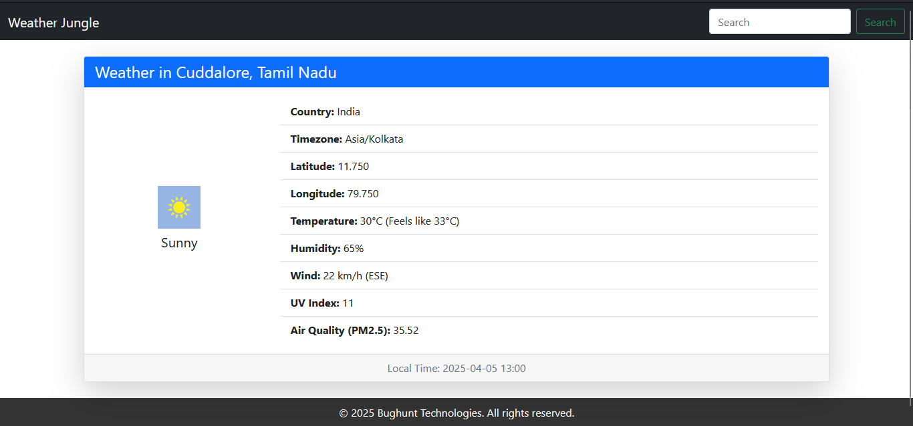

# Weather App

This is a Django-based web application that fetches and displays current weather data for a given location using the Weatherstack API. Users can enter a location, and the application will display weather details for that location.

## Features

- Users can input a location (city, country) to get the current weather.
- If no location is provided, the app will display the weather for New York by default.
- Weather data includes temperature, weather description, humidity, wind speed, and more.

## Technologies Included

This project utilizes the following technologies:

- **Django** - A high-level Python web framework used for backend development.
- **Weatherstack API** - Provides weather data that is fetched and displayed by the app.
- **Python** - Programming language used for the backend logic.
- **Requests** - Python HTTP library for making API requests to fetch weather data.
- **python-dotenv** - A library used to manage environment variables securely.
- **HTML/CSS** - Used for the front-end structure and styling.

## Prerequisites

Before running this app, make sure you have the following installed:

- Python 3.x
- Django
- Requests library
- Python-dotenv

## Screenshots

## 1. Weather Results (After submitting the location)

